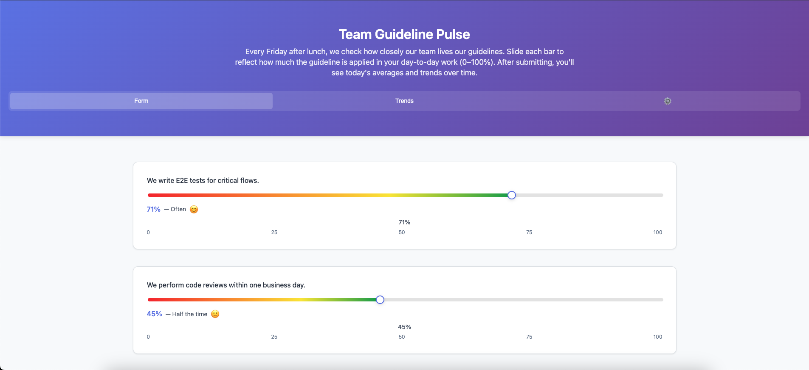
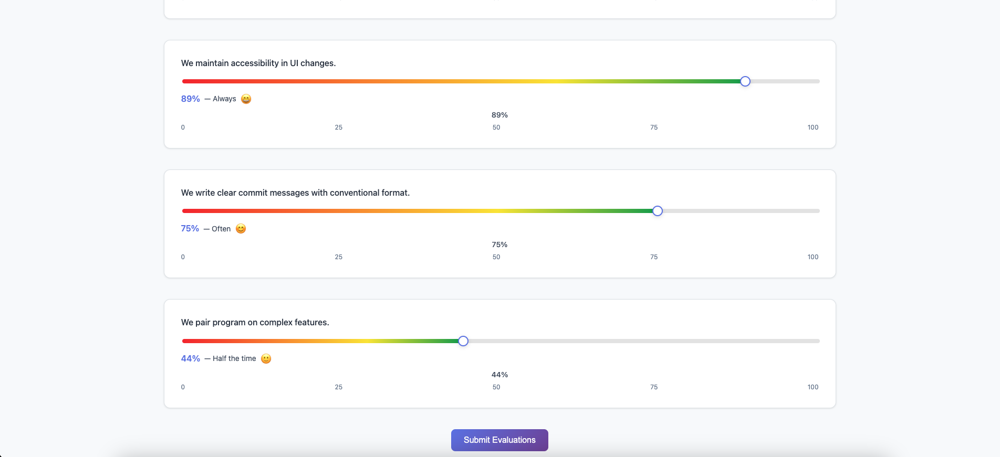
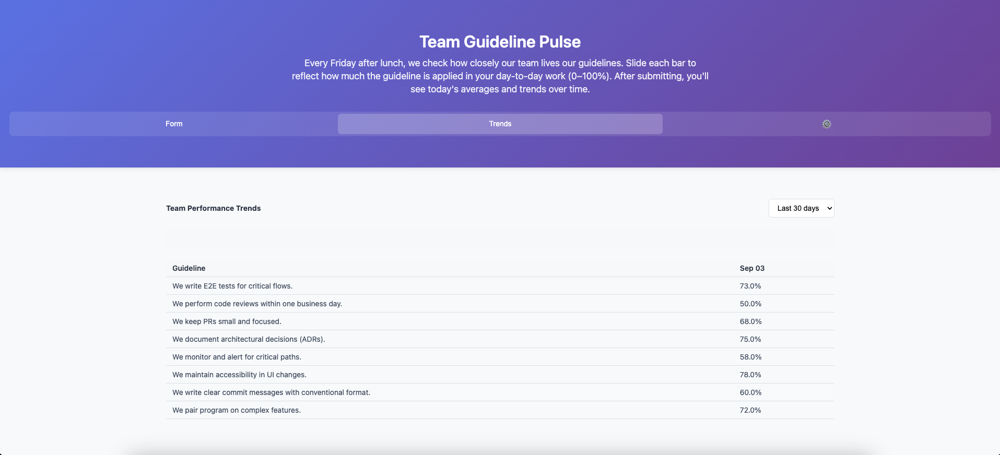
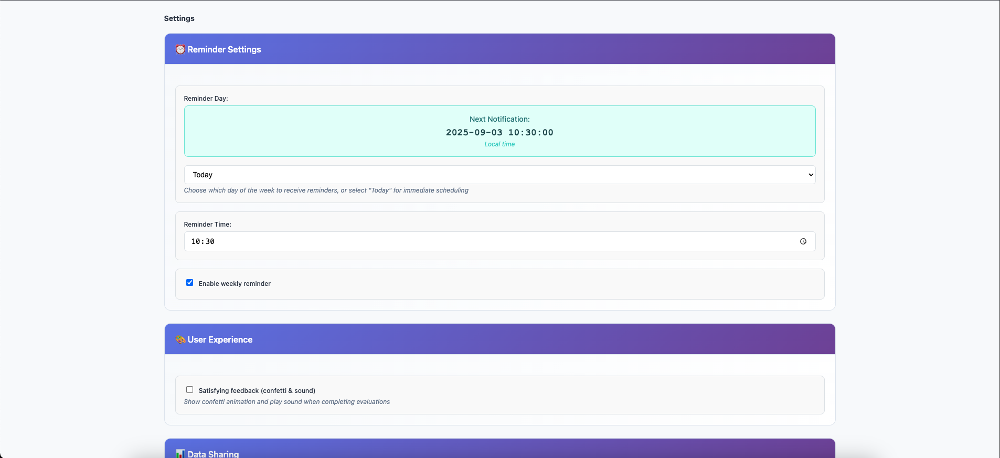
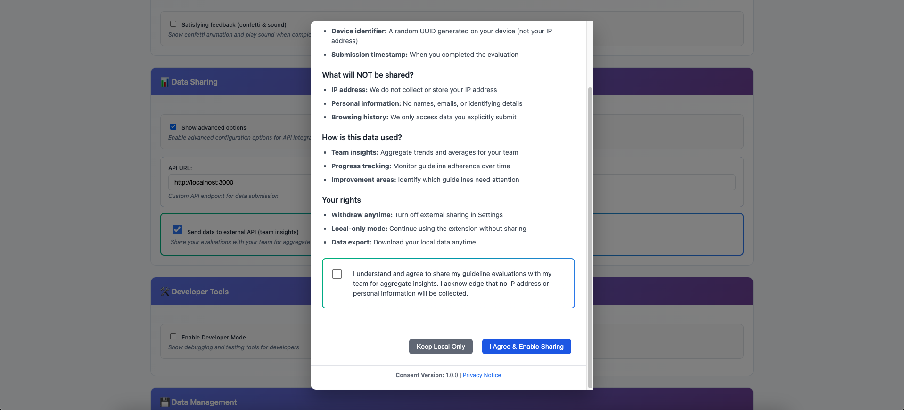
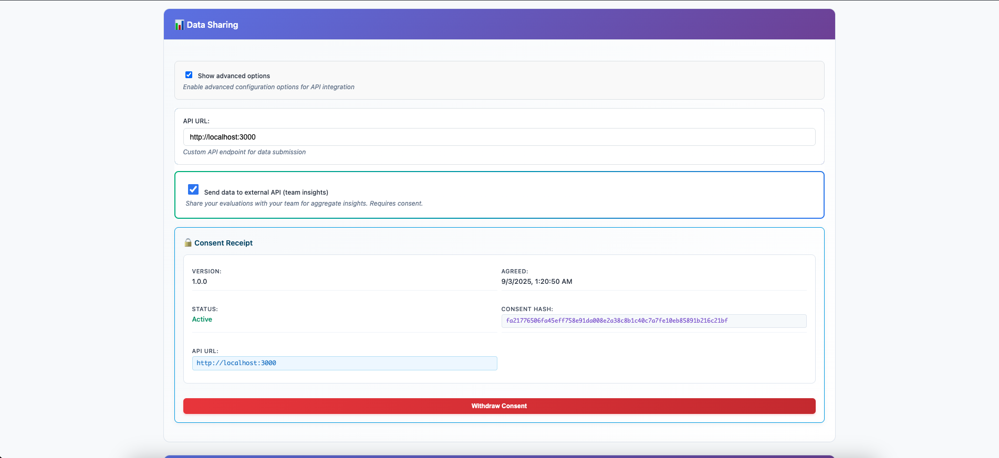

# PrivacyPulse Hub - Collaborative Data Collection Platform

> **Transform your team's insights into actionable data with privacy-first, anonymous, consent-driven pulse surveys**

[](https://chrome.google.com/webstore)
[](https://github.com/your-org/team-pulse)
[](./user-interface/PRIVACY_POLICY.md)

PrivacyPulse Hub 🔒 A privacy-first, anonymous Chrome extension for customizable pulse surveys & team collaboration. Works standalone (zero infrastructure) or with API backend. Privacy-focused, consent-driven, local storage by default. Perfect for happiness surveys, coding practices, research data collection.








📖 **[View Product Documentation & Features →](./PRODUCT.md)** | 📚 **[User Guide & Instructions →](./USER_GUIDE.md)**

## Quick Start

### Single Command Setup
```bash
./scripts/dev-setup.sh
```

This will:
- Start Postgres database on `localhost:5433`
- Start NestJS API on `http://localhost:3000`
- Run database migrations with pre-filled guidelines

### Verify Setup
```bash
curl http://localhost:3000/health
# Should return: {"status":"ok"}
```

## Docker Compose Environments

### Production Environment (Default)
```bash
# Start production environment
docker-compose up -d

# Start with build
docker-compose up -d --build

# View logs
docker-compose logs -f

# Stop production environment
docker-compose down
```

### Development Environment (Full PostgreSQL Permissions)
```bash
# Recommended: Use the setup script (handles permissions automatically)
./scripts/dev-setup.sh

# Alternative: Manual setup
docker-compose -f docker-compose.dev.yml up -d
./scripts/fix-dev-permissions.sh

# Start with build
docker-compose -f docker-compose.dev.yml up -d --build
./scripts/fix-dev-permissions.sh

# View logs
docker-compose -f docker-compose.dev.yml logs -f

# Stop development environment
docker-compose -f docker-compose.dev.yml down
```

### Development Setup Script
```bash
# Make script executable
chmod +x scripts/dev-setup.sh

# Run development setup (automatically handles permissions)
./scripts/dev-setup.sh
```

## Container Management

### View Running Containers
```bash
# Production containers
docker-compose ps

# Development containers
docker-compose -f docker-compose.dev.yml ps

# All containers
docker ps
```

### Container Logs
```bash
# Production logs
docker-compose logs -f

# Development logs (recommended for real-time)
docker-compose -f docker-compose.dev.yml up

# Development logs (detached mode)
docker-compose -f docker-compose.dev.yml logs -f

# Specific service logs
docker-compose -f docker-compose.dev.yml logs -f postgres
docker-compose -f docker-compose.dev.yml logs -f api

# Individual container logs (real-time)
docker logs -f usage-postgres-dev
docker logs -f usage-api-dev
```

### Restart Services
```bash
# Production restart
docker-compose restart

# Development restart
docker-compose -f docker-compose.dev.yml restart

# Restart specific service (development)
docker-compose -f docker-compose.dev.yml restart postgres
docker-compose -f docker-compose.dev.yml restart api
```

### Stop and Start
```bash
# Production stop/start
docker-compose stop
docker-compose start

# Development stop/start
docker-compose -f docker-compose.dev.yml stop
docker-compose -f docker-compose.dev.yml start
```

## Volume Management

### Refresh Containers and Volumes (Clean Start)
```bash
# Development clean start
docker-compose -f docker-compose.dev.yml down -v
docker-compose -f docker-compose.dev.yml down --volumes --remove-orphans

# Production clean start
docker-compose down -v
docker-compose down --volumes --remove-orphans
```

### Reset Database (Keep Containers)
```bash
# Remove only PostgreSQL volume
docker volume rm guidelines-for-ai-usage_pgdata

# Development volume
docker volume rm guidelines-for-ai-usage_pgdata_dev

# Start fresh (will recreate database)
docker-compose up -d
# or for development
docker-compose -f docker-compose.dev.yml up -d
```

### Backup and Restore
```bash
# Production backup
docker exec usage-postgres pg_dump -U postgres usage_db > backup.sql

# Development backup
docker exec usage-postgres-dev pg_dump -U postgres usage_db > backup_dev.sql

# Production restore
docker exec -i usage-postgres psql -U postgres usage_db < backup.sql

# Development restore
docker exec -i usage-postgres-dev psql -U postgres usage_db < backup_dev.sql
```

### Volume Inspection
```bash
# List all volumes
docker volume ls

# Inspect volume details
docker volume inspect guidelines-for-ai-usage_pgdata
docker volume inspect guidelines-for-ai-usage_pgdata_dev

# Remove unused volumes
docker volume prune
```

## Environment Switching

### From Production to Development
```bash
# Stop production
docker-compose down

# Start development
docker-compose -f docker-compose.dev.yml up -d
./scripts/fix-dev-permissions.sh
```

### From Development to Production
```bash
# Stop development
docker-compose -f docker-compose.dev.yml down

# Start production
docker-compose up -d
```

### Parallel Environments
```bash
# Run both environments on different ports
# Production: 5433, 3000
docker-compose up -d

# Development: 5434, 3001 (modify docker-compose.dev.yml ports)
docker-compose -f docker-compose.dev.yml up -d
./scripts/fix-dev-permissions.sh
```

## Troubleshooting

### Container Conflicts and Real-time Logs

#### Issue: Container name already in use
```bash
# Error: "The container name is already in use"
# Solution: Force remove existing containers
docker rm -f usage-postgres-dev usage-api-dev

# Then start fresh
docker-compose -f docker-compose.dev.yml up
```

#### Issue: Real-time logs not showing
```bash
# Problem: docker-compose logs -f not showing real-time logs
# Solution: Use foreground mode to see all logs from start
docker-compose -f docker-compose.dev.yml up

# Alternative: Use individual container logs for real-time
docker logs -f usage-postgres-dev
docker logs -f usage-api-dev

# For new logs only (tail=0 shows only new logs)
docker-compose -f docker-compose.dev.yml logs -f --tail=0

# Note: docker-compose logs -f may not show real-time logs in some environments
# Use docker logs -f <container-name> for guaranteed real-time streaming
```

#### Issue: PostgreSQL permissions problems
```bash
# Problem: postgres user can't delete rows (seeing "locker" in pgAdmin)
# Solution: Run the permissions fix script
./scripts/fix-dev-permissions.sh

# Or manually apply permissions
docker-compose -f docker-compose.dev.yml exec postgres psql -U postgres -d usage_db -c "
GRANT ALL PRIVILEGES ON DATABASE usage_db TO postgres;
GRANT ALL PRIVILEGES ON SCHEMA public TO postgres;
GRANT ALL PRIVILEGES ON ALL TABLES IN SCHEMA public TO postgres;
ALTER DEFAULT PRIVILEGES IN SCHEMA public GRANT ALL ON TABLES TO postgres;
ALTER USER postgres CREATEDB;
"
```

### Common Issues

#### Container won't start
```bash
# Check logs for specific service
docker-compose -f docker-compose.dev.yml logs postgres
docker-compose -f docker-compose.dev.yml logs api

# Check if containers are running
docker-compose -f docker-compose.dev.yml ps
```

#### Permission denied in PostgreSQL
```bash
# Connect to database
docker-compose -f docker-compose.dev.yml exec postgres psql -U postgres -d usage_db

# Check permissions
\du postgres
\dt+

# Verify table ownership (should show postgres=arwdDxt/postgres)
```

#### Port already in use
```bash
# Check what's using the ports
sudo lsof -i :5433  # PostgreSQL
sudo lsof -i :3000  # API

# Kill processes if needed
sudo kill -9 <PID>
```

#### Volume corruption or stale data
```bash
# Clean restart with volume removal
docker-compose -f docker-compose.dev.yml down -v
docker-compose -f docker-compose.dev.yml up -d
./scripts/fix-dev-permissions.sh
```

#### API returning 500 errors
```bash
# Check if container is running latest code
docker-compose -f docker-compose.dev.yml up --build

# Check API logs
docker-compose -f docker-compose.dev.yml logs -f api
```

#### Database migrations not running
```bash
# Check migration status
docker-compose -f docker-compose.dev.yml exec api npx sequelize-cli db:migrate:status

# Force run migrations
docker-compose -f docker-compose.dev.yml exec api npx sequelize-cli db:migrate
```

### Reset Everything

#### Nuclear option - removes everything
```bash
# Stop and remove all containers and volumes
docker-compose -f docker-compose.dev.yml down --volumes --remove-orphans

# Remove any orphaned containers
docker rm -f usage-postgres-dev usage-api-dev 2>/dev/null || true

# Clean up Docker system (optional - removes unused images/containers)
docker system prune -a --volumes

# Start fresh
./scripts/dev-setup.sh
```

#### Development environment reset
```bash
# Stop development environment
docker-compose -f docker-compose.dev.yml down

# Remove development volumes
docker volume rm guidelines-for-ai-usage_pgdata_dev 2>/dev/null || true

# Start fresh with setup script
./scripts/dev-setup.sh
```

### Debugging Commands

#### Check container status
```bash
# All containers
docker ps -a

# Project-specific containers
docker-compose -f docker-compose.dev.yml ps

# Container resource usage
docker stats usage-postgres-dev usage-api-dev
```

#### Database debugging
```bash
# Connect to PostgreSQL
docker-compose -f docker-compose.dev.yml exec postgres psql -U postgres -d usage_db

# Check table structure
\d guidelines
\d evaluations
\d consents

# Check data
SELECT COUNT(*) FROM guidelines;
SELECT COUNT(*) FROM evaluations;
SELECT COUNT(*) FROM consents;
```

#### API debugging
```bash
# Test API health
curl http://localhost:3000/health

# Test API endpoints
curl http://localhost:3000/guidelines
curl http://localhost:3000/legal

# Check API logs
docker-compose -f docker-compose.dev.yml logs -f api
```

## Project Structure

- `api-usage-processor/` - NestJS API with Sequelize + Postgres
- `user-interface/` - Chrome Extension (MV3, TypeScript)
- `docker-compose.yml` - Production environment
- `docker-compose.dev.yml` - Development environment (full permissions)
- `postgres-init-dev/` - Development PostgreSQL initialization scripts
- `scripts/dev-setup.sh` - Development environment setup script

## Development

### API Development
```bash
cd api-usage-processor
pnpm install
pnpm run dev
```

### Extension Development
```bash
cd user-interface
pnpm install
pnpm run build
# Load unpacked extension in Chrome
```

## Production Deployment

### API Deployment
1. Set production environment variables
2. Build Docker image: `docker build -t guideline-api ./api-usage-processor`
3. Deploy with your preferred container orchestration

### Extension Deployment
1. Build production bundle: `pnpm run build:prod`
2. Upload to Chrome Web Store or distribute privately

## Features

- **🔄 Standalone Mode**: Extension works independently without API backend
- **💾 Local Storage**: All data stored locally for complete privacy control
- **🔒 Privacy-First**: Data protection focused with full consent management
- **🎨 Fully Customizable**: Clone, modify, and deploy your own pulse surveys
- **📊 Real-Time Analytics**: Get instant insights and trends
- **🤝 Team Collaboration**: Share aggregated data while protecting individual privacy
- **⚡ Easy Deployment**: Self-hosted API with simple configuration
- **📱 Cross-Platform**: Chrome extension works everywhere
- **Weekly Reminders**: Every Friday at 13:30 (configurable)
- **Creative Sliders**: 0-100% gradient sliders with accessibility features
- **Consent Receipt**: Detailed consent tracking with hash verification
- **Developer Tools**: Built-in debugging and testing capabilities
- **Offline Support**: JSON fallback when API is unavailable
- **De-duplication**: Prevents duplicate submissions per day
- **DoS Protection**: Rate limiting and request validation

## Architecture

- **API-First Design**: Primary data source is the API
- **Incremental Updates**: Efficient daily aggregates with UPSERT
- **Client-Server Sync**: Device ID tracking with conflict resolution
- **Consent Management**: SHA-256 hashed consent validation system
- **Privacy-First**: Local-only mode by default, no IP collection
- **Security**: Rate limiting, validation, and optional shared secrets

## Local Development

- API: `http://localhost:3000`
- Database: `localhost:5433`
- Extension posts to local API by default
- Override settings via extension configuration panel

## Documentation

Each project includes:
- `README.md` - Setup and usage instructions
- `CHANGELOG.md` - Version history
- `ADRs/` - Architectural Decision Records
- `THIRD_PARTY_LICENSES.md` - Dependency licenses

## Support

For development issues, check the individual project READMEs and ADRs for detailed technical information.
